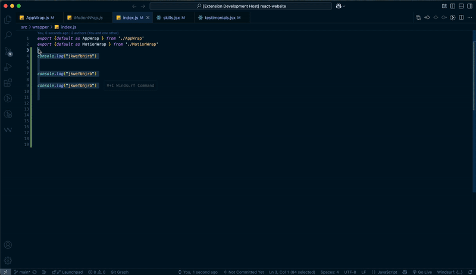

# Log Cleaner

A Visual Studio Code extension to remove logging statements from your codebase with a single command.

## Features

- **Remove All Logs**: Clean up all logging statements from your entire workspace
- **Remove Logs in Current File**: Clean up logging statements just in the current file
- **Configurable**: Customize which logging patterns to remove and which files to process
- **Multi-language Support**: Works with JavaScript, TypeScript, Python, Java, and more

## Usage



### Commands

1. Press `Ctrl+Shift+P` (Windows/Linux) or `Cmd+Shift+P` (macOS) to open the Command Palette
2. Type one of the following commands:
   - `Log Cleaner: Clean All Files`: Removes logging statements from all files in the workspace
   - `Log Cleaner: Clean Current File`: Removes logging statements only from the current open file

You can simply type "log clean" in the Command Palette to quickly find both commands.

### Keyboard Shortcuts

For even faster access, use these keyboard shortcuts:

- `Ctrl+Alt+L` (`Cmd+Alt+L` on macOS): Clean logs in current file
- `Ctrl+Alt+Shift+L` (`Cmd+Alt+Shift+L` on macOS): Clean logs in all files

### Configuration

You can customize the extension settings in VS Code's settings:

```json
// Settings for log patterns to remove
"logCleaner.patterns": [
  "console.log\\s*\\(.*?\\);?",
  "console.info\\s*\\(.*?\\);?",
  "print\\s*\\(.*?\\)",
  // Add your custom patterns here
],

// File extensions to process
"logCleaner.fileExtensions": [
  "js",
  "ts",
  "py",
  "java",
  // Add your file extensions here
],

// Folders to exclude
"logCleaner.excludeFolders": [
  "node_modules",
  "dist",
  "build",
  // Add folders to exclude here
]
```

## Supported Log Patterns (Default)

The extension comes with pre-configured patterns for common logging statements:

- JavaScript/TypeScript:
  - `console.log()`, `console.info()`, `console.warn()`, `console.error()`, `console.debug()`
- Python:
  - `print()`
- Java:
  - `System.out.println()`, `Log.d()`, `Log.i()`, `Log.w()`, `Log.e()`
- Generic:
  - `logger.info()`, `logger.debug()`, `logger.warn()`, `logger.error()`

## Adding Custom Log Patterns

If your project uses custom logging functions, you can add them to the `logCleaner.patterns` array in your VS Code settings.

Example for adding a custom pattern:

```json
"logCleaner.patterns": [
  "console.log\\s*\\(.*?\\);?",
  "myCustomLogger\\.log\\s*\\(.*?\\);?"
]
```

## Important Notes

- **Make a backup** or ensure you have committed your changes to version control before using this extension on your entire codebase.
- The extension uses regular expressions to match logging statements. In some complex cases, you might need to adjust the patterns to match your specific logging style.
- The extension will not remove logging statements in commented code.

## Release Notes

### 0.0.1

- Initial release with support for removing common logging statements across multiple languages
- Commands for cleaning entire workspace or just the current file
- Configurable patterns, file extensions, and exclusion folders